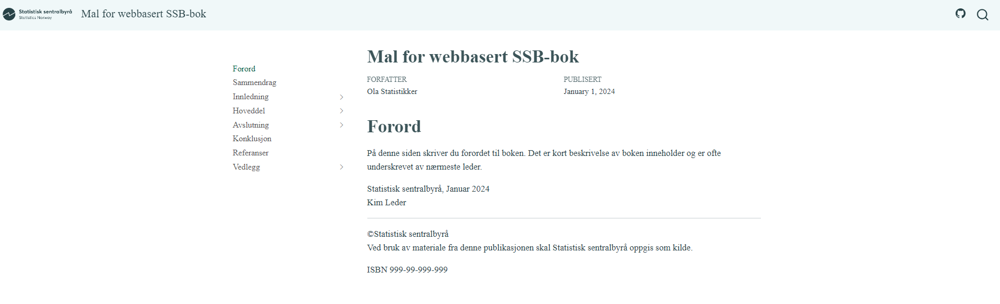

# ssb-quarto-book

This is a [Quarto](https://quarto.org/)-template for authoring longer, web-based documents at [Statistics Norway](https://www.ssb.no/) that are not hosted by SSBs official website. When rendered, the book looks like this:



## Basic usage

To use this template you need to have [Quarto](https://quarto.org/) installed. Then you can copy down the relevant files from this repo by running the following command in your terminal:

```bash
quarto use template skars82/ssb-quarto-book
```
 After running the above command the user will be prompted to trust the owner of this repo, and asked what the new folder should be named. After answering this prompt you can preview the example-files by running the following command in your terminal[^1]:

```bash
quarto preview input-files 
```
Alternatively, you can replace `preview` with `render` to render the entire book into html-files. The generated html-files will then be located in a folder called `./docs/` in the root of the project.

## Dapla usage

If you are using this template in SSBs new data platform, Dapla, it is recommended to create a `ssb-project` before you run the above commands: 

1. Log in to Dapla.
2. Open up a new terminal in your folder of choice.
3. [Create a ssb-project](https://manual.dapla.ssb.no/jobbe-med-kode.html)[^2].
3. Delete the folder called `./src/` in the root of the project.
4. Run the commands from the chapter on [Basic usage](#basic-usage) in your terminal.

Now you template is not at the root of the project. If you want this you have to move it. It is probably easier to have the folder `input-files` at the root of the project. To get this you can just move the files and the delete the existing directory. 

## Create you own book

After previewing the example-files you can start to edit the files in the `input-files`-folder. Some guidelines are provided in the example-book, else have a look at Quarto's [documentation](https://quarto.org/docs/guide/).

[^1]: In your terminal you should run these commands from the root of the project. If you are in the root of the project you should see a folder  called `/input-files/` when you run the command `ls` in your terminal. If you do not see this file you are not in the root of the project.

[^2]: You can create a `ssb-project` with or without a corresponding GitHub-repo. Typically, when building a book, you would want to host it on [GitHub Pages](https://pages.github.com/). If so, just creat a ssb-project with a [GitHub-repo](https://manual.dapla.ssb.no/jobbe-med-kode.html#med-github-repo). 


